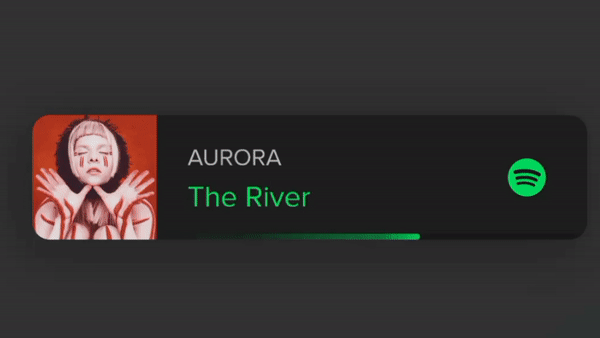

  
  

  
  

  
  <h1>KAVISHKA SANDARUWAN</h1>

### Hi there, I'm KAVISHKA [SANDARUWAN][website] 👋

## I'm a Student & Developer!!

- 🔭 I just launched my first course: [Become A VS Code SuperHero!][course]!
- 🌱 I’m currently learning everything 
- 👯 I’m looking to collaborate with other content creators
- 🥅 2021 Goals: Contribute more to Open Source projects
- ⚡ Fun fact: I love to draw and play violines

### Spotify Playing 🎧

### Connect with me:

[][website] [WEB SITE][website]      
[][youtube] [YOUTUBE][youtube]     
[][twitter] [TWITTER][twitter]      
[][twitter] [LINKEDIN][twitter]      
[][instagram] [INSTERGRAM][instagram]      
[][tiktok] [TIKTOK][tiktok]     
[][facebook] [FACEBOOK][facebook]     
[][spotify] [SPOTIFY][spotify]    

 

### Languages and Tools:

[][webdevplaylist]
[][webdevplaylist]
[][cssplaylist]
[][cssplaylist]
[][jsplaylist]
[][reactplaylist]
[][webdevplaylist]
[][webdevplaylist]
[][webdevplaylist]
[][webdevplaylist]
[][webdevplaylist]
[][webdevplaylist]
[][webdevplaylist]
[][webdevplaylist]
[][webdevplaylist]
[][webdevplaylist]

 
 

---

  
<H3>GitHub Stats</H3>

   

     

---
 

         

    

[website]: https://www.kavishka-sandaruwan.ml
[course]: http://vsCodeHero.com
[facebook]: facebook.com/kavishka.sandaruwan.0
[twitter]: https://twitter.com/kavishka__0
[tiktok]: https://www.tiktok.com/@kavishka.sandaruwan.0
[youtube]: https://www.youtube.com/channel/UCXhSoLCX0DIpNYh_0ICiP0w
[spotify]: https://open.spotify.com/user/lv7mdswbmu2ti3ffhl9sqanzz
[instagram]: https://www.instagram.com/kavishka.sandaruwan.0
[linkedin]: https://www.linkedin.com/in/kavishka-sandaruwan-b77654253
[webdevplaylist]: https://www.youtube.com/channel/UCXhSoLCX0DIpNYh_0ICiP0w/videos
[jsplaylist]: https://www.youtube.com/channel/UCXhSoLCX0DIpNYh_0ICiP0w/videos
[cssplaylist]: https://www.youtube.com/channel/UCXhSoLCX0DIpNYh_0ICiP0w/videos
[reactplaylist]: https://www.youtube.com/channel/UCXhSoLCX0DIpNYh_0ICiP0w/videos

 

 
  
 
  

